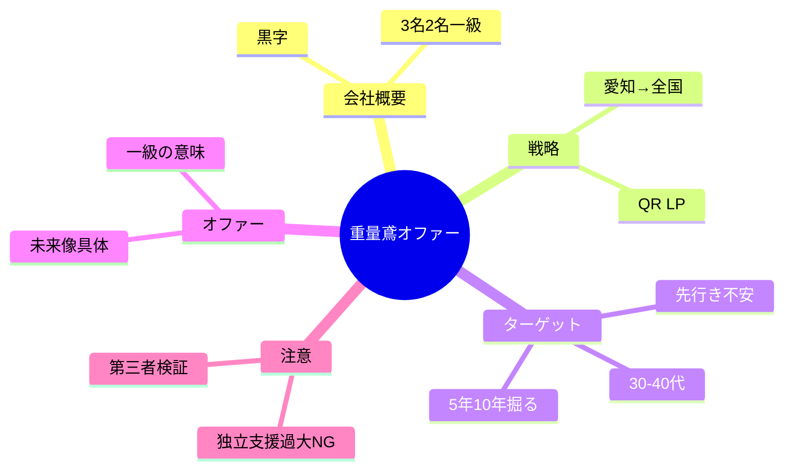

# 重量鳶・採用オファー設計（提出用マインドマップ下書き）

社長対話（`cleaned_transcript.md`）＋**前回提出マインドマップ**＋**師匠・山内さん助言**を統合した版です。  
XMind / MindMeister / Miro などに「中央ノード → 枝」として写せます。

---

## 中央ノードの候補（どれか1つに絞る）

- **A** 先行き不安な建設ベテランの「次の居場所」  
- **B** 次世代リーダー育成 × 資格で強くなる未来  
- **C** 嘘にしない強みで勝つ求人（安定の根拠＋未来像）

※提出時はA〜Cのどれを主軸にするか、グルコンで確定。

---

## マインドマップ全文（コピー用・インデント＝階層）

```
【重量鳶・採用オファー設計】
│
├─ 会社概要
│   ├─ 会社情報
│   │   ├─ 業種：重量鳶業
│   │   ├─ 従業員：3名（うち2名が一級とび技能士）
│   │   └─ 経営状態：黒字継続・安定経営
│   ├─ 採用目標
│   │   ├─ 目的：次世代リーダーの育成
│   │   ├─ 応募目標：年内5名
│   │   ├─ 採用目標：1名
│   │   └─ 育成期間：数年以内にリーダーへ
│   ├─ 募集条件
│   │   ├─ 雇用形態：正社員
│   │   ├─ 経験：建設業経験者（重量鳶未経験可）
│   │   ├─ 年齢：20代〜40代半ば
│   │   ├─ 給与：月収約28万円程度
│   │   └─ 資格取得支援：あり（※中身は嘘にならない範囲で言語化）
│   └─ エリア戦略
│       ├─ 第1段階：愛知県限定
│       ├─ 第2段階：三重・岐阜・近畿に拡大
│       └─ 第3段階：住み込み相談可で全国
│
├─ 採用チャネル戦略
│   ├─ メイン：社長のアナログ活動（名刺QR・地元ネットワーク）
│   ├─ サブ：リスティング広告
│   └─ LPの位置づけ：応募を決断するツール（社長の声かけ→QRで誘導）
│
├─ 採用の難しさ（前提認識）
│   ├─ 建設業界のイメージ（キツイ・汚い・危険）
│   ├─ 重量鳶の認知度の低さ（業界人も知らない）
│   └─ 小規模3人→ブランド力が低い
│
├─ 社長の思い
│   ├─ 「会社の将来が不安…」に応えたい
│   ├─ 次世代育成に本気（駄目ならたたむことも視野／インフラとして続けたい思いも）
│   └─ 正直さ：手取り足取り独立支援はしない（過大表現はしない）
│
├─ ターゲット設定（仮説ペルソナ・前回提出）
│   ├─ 基本情報
│   │   ├─ 30代後半〜40代前半
│   │   ├─ 名古屋市近郊在住
│   │   └─ 家族：妻・子2人
│   ├─ 職歴
│   │   ├─ 足場工事会社に約10年
│   │   ├─ 玉掛け・フォークリフト等の資格
│   │   ├─ 役職なしベテラン作業員
│   │   └─ 年収約420万円程度
│   ├─ 悩み（状況）
│   │   ├─ 社長65歳・後継者なし→将来不安
│   │   ├─ 危機兆候（体調・給与遅延・賞与カット・取引先噂・売却・廃業の話 等）
│   │   ├─ 家族・親からの「大丈夫？」「安定したところに」
│   │   ├─ 若手離脱で負担増・休めない・職場がピリピリ・パワハラ気味
│   │   └─ 「50歳では遅い」焦り／足場以外に通用するか不安
│   ├─ 願望（収入以外・前回まで）
│   │   ├─ 安心して長く働ける環境
│   │   ├─ 資格を活かして働きたい
│   │   └─ 職人の人間関係に疲れている
│   └─ 【師匠指摘】ここからさらに掘る
│       ├─ 5年後・10年後にどうしていたいか（目先だけでない層もいる）
│       ├─ 「潰れた人」より「潰れてはいないが先行き不安で動いた人」インタビュー
│       └─ 社長ヒアリングだけでは出ない→実在の転職者に聞く
│
├─ 論点整理（この案件の4本柱）
│   ├─ ① ターゲットは誰か
│   │   ├─ 先行き不安な建設系ベテラン
│   │   ├─ vs 独立志向・向上心タイプ（山内案：間口は狭まるが定着・学習意欲）
│   │   └─ 決め：主ターゲット／サブターゲットの線引き
│   ├─ ② 本当に怖いこと・本当に欲しいこと
│   │   ├─ 「安定したい」だけでは弱い
│   │   ├─ 将来の選択肢・自分の力・安心の根拠・家族への説明責任 等
│   │   └─ 重量鳶経験者は大変さを知って敬遠も→訴求とターゲットの整合要検証
│   ├─ ③ 入社するとどうなれるか（強いオファー）
│   │   ├─ 「最終的な立場・働き方・未来」を具体像で見せる（次世代リーダーなら必須）
│   │   ├─ 「3人中2人が一級」は事実→それで何が実現するかまで言語化
│   │   │   └─ 例：建設業の許可・顧客からの信頼・転職市場での優位・キャリアの幅
│   │   └─ ロードマップ（年次）を数字で固定
│   └─ ④ 嘘にならない打ち出し
│       ├─ 独立支援の過大表示はNG
│       ├─ OK：真面目に働けば資格・力が身につく可能性／社内にロールモデル
│       └─ 人間関係・楽さ・永遠安泰は言い過ぎ注意
│
├─ 訴求の流れ（LP・リスティング共通）
│   ├─ ① 悩み・先行き不安への共感
│   ├─ ② 信頼の根拠（経営・仕事の取り方・顧客・黒字・実在の人）
│   ├─ ③ 重量鳶とは（認知度が低いので後ろに回す）
│   └─ ④ 未来像＋資格の意味＋応募の決断理由
│
├─ 山内さん助言（採用後・戦略オプション）
│   ├─ 入社後に「後継者としてここがいい」と思ってもらう流れもあり得る
│   ├─ 独立志向者→将来は協力会社・下請け関係の可能性
│   └─ 鳶系はすぐ辞めやすい→量より質・意欲ある人に絞る案
│
├─ 検証アクション（師匠助言）
│   ├─ オファー案を第三者（社長の知人など）に見せる→「いいですね」と言われるか
│   ├─ 刺さらなければLP制作の優先度を見直す
│   └─ インタビュー：先行き不安で転職したが会社は潰れていない人
│
└─ 次の宿題チェックリスト
    ├─ 5年後10年後の願望をペルソナに追記（インタビューで裏取り）
    ├─ 一級技能士「だから何ができるか」を求職者向け1〜3文で固定
    ├─ リーダー像の具体（役割・現場での立ち位置・数年後の絵）
    ├─ メイン／サブターゲットの決定（不安型 vs 向上心型）
    └─ 第三者レビュー1回
```

---

## 師匠への確認質問（更新版）

1. **主ターゲット**：先行き不安ベテランを主にするか、向上心・独立気質を主にするか、主副の配分は？  
2. **未来像**：「数年後のリーダー」の1枚絵（勤務時間・責任・収入のイメージまで）どこまで書けるか？  
3. **一級2名**：LPで言う一文は「信頼」「許可」「キャリアの幅」のどれを最優先にするか？

---

## Mermaid（簡易）



---

## ファイルの扱い

- 元：`cleaned_transcript.md`（社長対話）  
- 本ファイル：提出・グルコン用の**統合マインドマップ下書き**  
- 個人名・社名は提出ルールに合わせてマスキングしてください。
